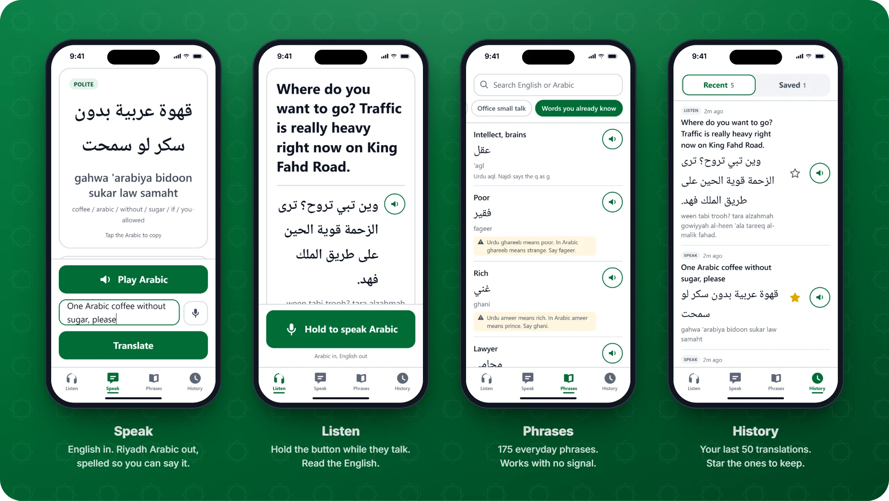
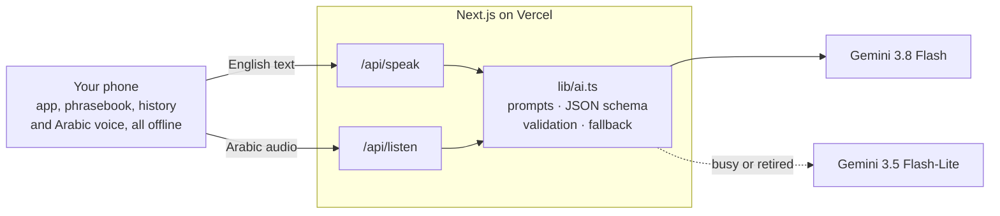

<p align="center">
  
</p>

<h1 align="center">Arabic Translator</h1>

<p align="center">
  <b>English ⇄ Saudi Arabic, the way Riyadh actually talks.</b><br>
  Type it or say it. Hold a button when someone speaks. 175 phrases that work with no signal.
</p>

<p align="center">
  <a href="#how-it-was-vibe-coded"></a>
  
  
  
  
  
  <a href="LICENSE"></a>
</p>

<p align="center">
  <a href="https://arabic-translator-ssd.vercel.app"></a>
</p>

<p align="center">
  <a href="#use-it">How to use it</a> ·
  <a href="#get-your-own-copy">Get your own copy</a> ·
  <a href="#how-it-was-vibe-coded">How it was vibe coded</a>
</p>

<p align="center">
  
</p>

Most translators give you **Modern Standard Arabic**, the formal Arabic of news
broadcasts and textbooks. Use it in a Riyadh taxi and you sound like a
newsreader. This app speaks **Najdi**, the dialect you actually hear in Riyadh:
*ween* instead of *ayna* for "where", *abgha* instead of *ureed* for "I want",
and *gahwa* with a hard *g*.

It works the other way too. Hold the button while someone talks, and read what
they said in English.

> [!NOTE]
> **This app is vibe coded.** The code was written by
> [Claude Code](https://claude.com/claude-code) from plain-English requests, one
> pull request at a time, and tested on real phones.
> [See how it was built ↓](#how-it-was-vibe-coded)

## What makes it different

<table>
<tr>
<td width="33%" valign="top">
<b>Najdi, not MSA</b><br>
Riyadh's spoken dialect: ق said as <i>g</i>, <i>mo</i> for "not", <i>abgha</i>
for "I want". A note appears when the textbook Arabic would say it differently.
</td>
<td width="33%" valign="top">
<b>Both genders, always</b><br>
Arabic changes with who is speaking <i>and</i> who is listening. You get every
form, plus one default to read aloud.
</td>
<td width="33%" valign="top">
<b>Say it without learning the script</b><br>
Plain Latin letters you can read cold: <i>ween agrab saydaliyya?</i> No numbers
standing in for letters, no academic dots.
</td>
</tr>
<tr>
<td valign="top">
<b>Learn the pieces</b><br>
A word-by-word gloss under every result, like <i>coffee / arabic / without /
sugar</i>. You pick up the words, and a bad translation is easy to spot.
</td>
<td valign="top">
<b>Works with no signal</b><br>
175 everyday phrases live on your phone: greetings, taxis, food, shopping,
numbers, emergencies. Basement car parks included.
</td>
<td valign="top">
<b>Words you already know</b><br>
Speak Urdu or Hindi? 52 words carry straight over, and 9 false friends are
flagged: <i>ghareeb</i> means "strange" here, not "poor".
</td>
</tr>
</table>

### Real output

Unedited results from the app:

| You type | You get | Say it |
| --- | ---: | --- |
| Take me to the nearest pharmacy | ودني أقرب صيدلية لو سمحت | *widdini agrab saydaliyya law samaht* |
| One Arabic coffee without sugar, please | قهوة عربية بدون سكر لو سمحت | *gahwa 'arabiya bidoon sukar law samaht* |
| I'm running ten minutes late | أنا متأخر عشر دقايق | *ana mit'akhkhir 'ashr dagayig* |
| Where is the bathroom? | وين الحمام؟ | *ween al-hammam?* |
| Thank you, that was delicious | الله يعطيك العافية، كان لذيذ مرة | *allah ya'teek al-'afya, kaan latheez marrah* |

## Use it

Open **[arabic-translator-ssd.vercel.app](https://arabic-translator-ssd.vercel.app)**
on your phone. It's a web app that installs like a native one.

### 1. Put it on your home screen

| iPhone (Safari) | Android (Chrome) |
| --- | --- |
| **Share** → **Add to Home Screen** → **Add** | **⋮** menu → **Install app** or **Add to Home screen** |

It then opens full screen, with no browser bars. On iPhone this only works from
Safari, not Chrome.

### 2. First launch

- **Tap Play Arabic once.** iPhones only allow speech after a tap, and this
  unlocks it for the session.
- **Allow the microphone** when asked. Listen and English dictation need it.
- **Seeing "No Arabic voice on this device"?** Your phone reads the Arabic
  aloud with its own voice, which is a free download:
  - **iPhone:** Settings → Accessibility → Spoken Content → Voices → Arabic
  - **Android:** Settings → search *Text-to-speech* → set the preferred engine
    to **Google Text-to-speech** → tap the gear icon → **Install voice data** →
    Arabic (Saudi Arabia if offered)

  Then fully close the browser and reopen the app.

### 3. Everyday use

| When… | Do this |
| --- | --- |
| You need to tell a driver where to go | **Speak**: type or dictate it, then show the big Arabic or tap **Play Arabic** |
| Someone is talking to you | **Listen**: hold the button, point the phone at them, release when they stop |
| There's no signal | **Phrases**: search in English, Arabic or transliteration |
| You'll need a phrase again | **History**: tap the star. Starred items survive "Clear history". |

A few things that save time:

- Tap any Arabic to copy it, for example to paste into WhatsApp.
- Search ignores apostrophes, so `siruh` finds *kam si'ruh?*
- When you go offline, Listen and Speak grey out and the app switches to
  Phrases. Reconnect and you're back where you were.

> [!WARNING]
> **AI translations can be confidently wrong.** While testing, one came back
> with "left" turned into "right". For anything that matters, like directions,
> medicine or money, check the word-by-word gloss under the result. It makes
> that kind of slip easy to spot.

## Get your own copy

The link above runs on one shared free API key, so it can hit Google's limits
when lots of people use it at once. Your own copy is free, takes about five
minutes, and needs no coding. You'll need free GitHub and Vercel accounts.

1. **Get a free Gemini API key.** Go to
   [Google AI Studio](https://aistudio.google.com/apikey) → **Get API key** →
   **Create API key**. No billing needed.
2. **Click Deploy.** Vercel copies this repo into your GitHub account, asks for
   the key, and builds your app.

   [](https://vercel.com/new/clone?repository-url=https%3A%2F%2Fgithub.com%2Fsartaj1995%2Farabic-translator&env=GOOGLE_GENERATIVE_AI_API_KEY&envDescription=A%20free%20Gemini%20API%20key%20from%20Google%20AI%20Studio.%20No%20billing%20needed.&envLink=https%3A%2F%2Faistudio.google.com%2Fapikey)

3. **Install it** on your phone from your new
   `https://<your-project>.vercel.app` address,
   [the same way as above](#1-put-it-on-your-home-screen).

> [!TIP]
> **It costs nothing for personal use** on Vercel's Hobby plan and Gemini's free
> tier. Anything you push to your copy's `main` branch goes live
> automatically. In Vercel, mark the key as **Sensitive** so it can't be read
> back.

<details>
<summary>Prefer to set it up by hand?</summary>

1. Fork this repo.
2. At [vercel.com/new](https://vercel.com/new), import your fork. Vercel
   detects Next.js, so there are no build settings to change.
3. Add the environment variable `GOOGLE_GENERATIVE_AI_API_KEY` with your key,
   for Production and Preview.
4. Deploy.

</details>

## Run it locally

You'll need Node 20 or newer.

```bash
git clone https://github.com/sartaj1995/arabic-translator.git
cd arabic-translator
npm install
cp .env.example .env.local
```

Paste your Gemini key into `.env.local`, start the dev server, and open
<http://localhost:3000>:

```bash
npm run dev
```

| Variable | Default | What it does |
| --- | --- | --- |
| `GOOGLE_GENERATIVE_AI_API_KEY` | **required** | Your Gemini key. Both `AIza…` and the newer `AQ.…` keys work. |
| `GEMINI_TEXT_MODEL` | `gemini-3.8-flash` | Model for Speak |
| `GEMINI_AUDIO_MODEL` | `gemini-3.8-flash` | Model for Listen. Must accept audio. |
| `GEMINI_FALLBACK_MODEL` | `gemini-3.5-flash-lite` | Backup when the main model is busy or retired |
| `AI_TIMEOUT_MS` | `20000` | Give up on a model call after this many milliseconds |

Restart `npm run dev` after editing `.env.local`. Next.js only reads it at
startup.

| Script | What it does |
| --- | --- |
| `npm run dev` | Dev server with hot reload |
| `npm run build` | Production build |
| `npm start` | Serve the production build. Offline mode only works here. |
| `npm run lint` | ESLint |

## Make it yours

Each part you'd want to change lives in one place.

| To… | Change |
| --- | --- |
| Target a different dialect (Egyptian, Levantine, Gulf…) | The `DIALECT` block in [`lib/prompts.ts`](lib/prompts.ts) |
| Spell pronunciation differently | The `TRANSLITERATION` block in [`lib/prompts.ts`](lib/prompts.ts) |
| Add or edit phrases | [`public/phrasebook.json`](public/phrasebook.json). Bump its `version`, and `CACHE_VERSION` in [`public/sw.js`](public/sw.js), so installed phones pick up the change. |
| Switch the AI model | The environment variables above. No code changes. |
| Use a different AI provider | [`lib/ai.ts`](lib/ai.ts), the only file that talks to an AI SDK |
| Support another language entirely | The prompts and phrasebook, plus the voice picker in [`lib/voiceSelection.ts`](lib/voiceSelection.ts), which only accepts Arabic voices on purpose |

## How it works



- **Speak** sends your English to `/api/speak`. A single Gemini call,
  constrained to a JSON schema, returns the Arabic, the transliteration, the
  gloss, the register, a note when MSA differs, and the gender forms. The
  server validates every field before your phone sees it.
- **Listen** records a clip on the phone and sends it to `/api/listen`. One
  multimodal call transcribes *and* translates, with no separate
  speech-to-text step. If the model can't make out the audio, the app says so
  instead of guessing.
- **Speech** comes from your phone's own Arabic voice, so there's no
  text-to-speech bill and it works offline.
- **Offline**, a service worker and IndexedDB keep the app, the phrasebook and
  your history on the device.
- **When Google's model is busy or retired**, the server tries a second model.
  Google's limits are per model, so the backup usually has room.

## How it was vibe coded

This app was built by describing what was needed to
[Claude Code](https://claude.com/claude-code) in plain English, one feature at a
time. Claude Code wrote the code, the commits and the pull-request write-ups.
The human side was deciding what to build, trying each version on a real
phone, and reporting what broke.

It went from an empty repo to a working, installable app in under a week, then
kept improving from real use:

| Day | Pull request | What it did |
| --- | --- | --- |
| 1 | [#1](https://github.com/sartaj1995/arabic-translator/pull/1) | **Speak** mode and the installable app shell |
| 3 | [#3](https://github.com/sartaj1995/arabic-translator/pull/3) | **Listen** mode: Arabic audio to English in a single AI call |
| 6 | [#4](https://github.com/sartaj1995/arabic-translator/pull/4) | Pinned the AI model after a floating alias broke the live app |
| 6 | [#5](https://github.com/sartaj1995/arabic-translator/pull/5) | Offline phrasebook, history and the Saved list |
| 6 | [#6](https://github.com/sartaj1995/arabic-translator/pull/6) | Picks the best Arabic voice on each phone |
| 9 | [#8](https://github.com/sartaj1995/arabic-translator/pull/8) · [#9](https://github.com/sartaj1995/arabic-translator/pull/9) | Voice-install help on every screen, meal words, and the Urdu-cognates list |
| 9 | [#11](https://github.com/sartaj1995/arabic-translator/pull/11) | Fixed a real Android bug: newly installed voices weren't detected |
| 11 | [#12](https://github.com/sartaj1995/arabic-translator/pull/12) | Calories and protein, since Saudi menus print calorie counts by law |
| 13 | [#13](https://github.com/sartaj1995/arabic-translator/pull/13) | Google retired the old model, so: new model plus a fallback |

### Build your own

Anyone can make one of these for their own city and dialect. What worked here:

1. **Start with one screen, end to end.** The first version was only Speak,
   but it was deployed and installable on a phone from day one.
2. **Keep the AI in two files.** All prompt text lives in `lib/prompts.ts` and
   all model calls in `lib/ai.ts`. When the model stopped working, twice, the
   code fix both times was in `lib/ai.ts`.
3. **Test on a real phone, early.** iPhone audio formats, Android voice lists
   and glare in the midday sun don't show up on a laptop.
4. **Ask for the why.** Every pull request here explains its reasoning, so each
   new session starts with the context of the last.

A starting prompt for Claude Code:

```text
Build a mobile-first web app (PWA) that translates between English and
<your dialect> as it is spoken in <your city>.

- Speak: English text in; the dialect out, in native script plus an easy
  Latin transliteration, a word-by-word gloss, and both gender forms.
- Listen: hold a button to record someone speaking, send the audio to
  Gemini, and show the English.
- An offline phrasebook of everyday phrases (taxi, food, shopping, numbers,
  emergencies) that works with no signal.

Use Next.js and the Gemini API, deployed on Vercel. Keep all prompt text in
one file and all model calls in another. Build it in phases, one pull request
per phase, and explain each decision in the pull request.
```

## Under the hood

The engineering notes, for anyone changing the code.

<details>
<summary><b>Project structure</b></summary>

```
app/
  layout.tsx            PWA metadata, manifest link, viewport and safe areas
  page.tsx              App shell: bottom nav, shared voice and history, offline switch
  globals.css           Design tokens: high-contrast light theme, Arabic font stack
  api/speak/route.ts    English → Arabic. Rate limited, validates input.
  api/listen/route.ts   Arabic audio → English. Rate limited, size and confidence guards.
lib/
  ai.ts                 ← ALL model calls, including the fallback. Swap providers here.
  prompts.ts            ← ALL prompt text. Tune the dialect without touching logic.
  tts.ts                Browser speechSynthesis wrapper
  voiceSelection.ts     Ranks the phone's voices and picks the best Arabic one
  dictation.ts          English dictation via SpeechRecognition, where supported
  audio.ts              Push-to-talk MediaRecorder hook
  audioFormats.ts       Container negotiation and Gemini MIME normalisation
  db.ts                 Minimal IndexedDB wrapper, no dependencies
  phrasebook.ts         Cache-first phrasebook loader and search
  history.ts            Last 50 translations, plus the Saved list
  rateLimit.ts          In-memory sliding-window rate limiter
  errors.ts             AppError and safe error responses
  types.ts              Shared contracts
  useCopy.ts            Tap-to-copy hook
  useOnline.ts          Online/offline hook
components/             The four screens and their controls
public/
  manifest.webmanifest  PWA manifest
  sw.js                 Hand-written service worker
  phrasebook.json       175 Riyadh phrases in 9 categories
  icons/                App icons
docs/images/            README images, and the social preview uploaded in repo Settings
```

</details>

<details>
<summary><b>Design decisions</b></summary>

- **Najdi, not MSA.** ق is transliterated `g` (`agrab`, `gahwa`), negation is
  `mo`, and "I want" is `abgha`. When the Najdi differs meaningfully from MSA,
  the result shows a note.
- **Both gender forms, always.** Arabic conjugates on two axes: who is speaking
  and who is being addressed. The `variants` array carries every form the
  phrase can take. The top-level `arabic` is the masculine/masculine default,
  so there is one unambiguous line to read aloud.
- **Plain phonetic transliteration.** No Arabizi numerals and no academic
  diacritics, just Latin letters you can read cold under pressure.
- **High-contrast light theme.** Dark themes wash out in Riyadh daylight. The
  base font size is 18px, controls sit in the bottom third for one-handed use,
  and pinch-zoom stays enabled.

</details>

<details>
<summary><b>AI models, the fallback, and API keys</b></summary>

**The models are pinned on purpose.** The app first used the floating alias
`gemini-flash-latest`, which does not resolve on every API key and left the
deployed app failing on every request. The next pin, `gemini-2.5-flash`, broke
the same way once Google limited the 2.5 models to keys that had already used
them. The default is now `gemini-3.8-flash`, which Google marks stable and
recommends for new projects. Upgrading is always an explicit change.

**The fallback.** `generateJson` in `lib/ai.ts` tries the main model, then
`GEMINI_FALLBACK_MODEL`, when the failure is one a different model could
avoid: Google overloaded (503) or out of quota (429), the model retired, or
unusable JSON twice. It does not fall back on a timeout, because a second
20-second wait in a taxi is worse than "try again". It also doesn't fall back
when the key itself is rejected, because the fallback uses the same key. Each
fallback is logged, so a dead main model still shows up in the Vercel logs:

```text
[ai] gemini-3.8-flash failed with UPSTREAM_ERROR; trying gemini-3.5-flash-lite
```

Free-tier limits are per model, and tight on the newest ones. At the time of
writing, Gemini 3.8 Flash allows 5 requests a minute on the free tier, which is
one reason the fallback exists.

**Keys starting with `AQ.` or `AIza`.** Both work. Google AI Studio has issued
`AQ.` keys since mid-2026, while Google Cloud Console still issues `AIza` ones.
`AQ.` keys only authenticate via the `x-goog-api-key` header, and some
third-party tools reject them because they pass the key as a `?key=` query
parameter. This app uses the official `@google/genai` SDK, which sets the
header. If an `AQ.` key is rejected anyway, create an `AIza` key in Google Cloud
Console → APIs & Services → Credentials, with the *Generative Language API*
enabled.

**"That model is not available on your API key".** List the models your key
can reach, then set `GEMINI_TEXT_MODEL` and `GEMINI_AUDIO_MODEL` to one of them:

```bash
curl -s -H "x-goog-api-key: YOUR_KEY" "https://generativelanguage.googleapis.com/v1beta/models" | grep -o '"name": "[^"]*"'
```

**Checking a key works.** With the dev server running:

```bash
curl -s -X POST http://localhost:3000/api/speak -H "Content-Type: application/json" -d '{"text":"how much is this"}'
```

A working key returns JSON with `arabic`, `transliteration`, `literal_gloss`,
`register`, `msa_note` and `variants`. A missing key returns
`{"error":{"code":"NO_API_KEY",...}}`.

</details>

<details>
<summary><b>Listen mode and the iPhone audio problem</b></summary>

Hold the big button, speak (or point the phone at whoever is speaking), then
release. The clip goes to `/api/listen`, which makes **one** multimodal Gemini
call that transcribes and translates in a single step. English comes back
first and largest, with the Arabic and transliteration below it for checking
and learning.

Recording is capped at 30 seconds, and anything under 400ms is treated as an
accidental tap. If the model reports a confidence below 0.4, the app says it
couldn't make out the audio rather than showing a confident-looking guess.
Between 0.4 and 0.75, the result is shown with an "audio was unclear" flag.

**The container problem.** `MediaRecorder` output differs by platform, so the
type is probed at runtime rather than hardcoded: Chrome and Android give
WebM/Opus, iOS Safari gives MP4/AAC. The less obvious trap is that **Gemini
does not accept `audio/mp4`**, which is exactly what iOS produces. It does
accept `audio/m4a`, and M4A is AAC in an MP4 container, the same bytes with a
different label. `normaliseForGemini` in `lib/audioFormats.ts` does the
relabelling without transcoding. It runs on both the client and the server, so
a bad label can't reach the API either way.

</details>

<details>
<summary><b>Text to speech and voice selection</b></summary>

The app uses the browser's built-in `speechSynthesis`, so there's no paid
text-to-speech API. `lib/tts.ts` handles the known problems explicitly:

1. **Voices load asynchronously.** `getVoices()` is empty on the first call. The
   app listens for `voiceschanged` and also polls for about 3.5 seconds,
   because Safari sometimes never fires that event.
2. **iOS needs a user gesture.** A silent utterance is spoken on your first tap
   to unlock speech for the session.
3. **No Arabic voice installed.** The app refuses to speak rather than reading
   Arabic script in an English voice, and explains how to install one.
4. **A voice installed while the app is open.** The voice list is re-read when
   the app returns to the foreground, so going to Settings and coming back is
   enough.

**Which voice gets picked.** Phones expose wildly different voice lists, so
`lib/voiceSelection.ts` ranks them rather than looking for one name. Arabic is
a hard requirement: a non-Arabic voice can never be chosen, and returning
nothing is the correct answer when the phone has no Arabic voice.

Among Arabic voices, the ranking is **offline-capable first, then closest
accent**: Saudi, then Gulf, then unmarked `ar`, then other regions. Offline
capability outranks accent deliberately. A remote voice in a taxi with no
signal either lags badly or silently does nothing, while a local
Egyptian-accented voice still produces Arabic a Riyadh driver understands.
Lower `LOCAL_BONUS` below 100 to flip that.

`lang` may arrive as `ar-SA`, `ar_SA`, `ar-EG`, bare `ar`, or `ara` (Android
passes through the three-letter code), and all of them are handled. A plain
`startsWith("ar")` test would be *wrong*: `arc` is Aramaic and `arn` is
Mapudungun, and either would otherwise be chosen to read Arabic script.

</details>

<details>
<summary><b>Offline phrasebook, history and saved</b></summary>

The phrasebook has 175 everyday Riyadh phrases in nine categories: greetings,
taxi, coffee and food, shopping, colours, numbers, emergencies, office small
talk, and words an Urdu or Hindi speaker already knows.

That last category is a shortcut. Urdu borrowed heavily from Arabic, so words
like *kitaab*, *khabar*, *naseeb* and *imtihaan* carry over unchanged, and each
entry says so. Where the two languages have drifted apart, the entry carries a
warning instead: calling someone *ghareeb* to mean "poor" lands as "strange" in
Arabic. Nine such traps are flagged.

Search covers English, Arabic script and transliteration at once, and ignores
apostrophes, so you don't have to guess where the *'ayn*s go. Several words
narrow the results rather than widen them.

**It works with zero network.** The service worker precaches the phrasebook,
and it's stored in IndexedDB on first load. After that, it's read from
IndexedDB *before* anything touches the network. To ship new phrases, edit
`public/phrasebook.json` and bump its `version`, so phones replace their cached
copy. Also bump `CACHE_VERSION` in `public/sw.js`, because the file is
precached and would otherwise keep being served stale.

**History** keeps your last 50 translations, newest first, tagged by mode. Tap
a row to copy the Arabic, or replay it. The star pins an item to **Saved**.
Saved items don't count toward the 50-item cap and survive "Clear history";
otherwise a star would be meaningless once fifty newer translations pushed it
out.

</details>

<details>
<summary><b>Rate limiting</b></summary>

Each API route allows 20 requests a minute per IP address. The limiter is
in-memory, so each serverless instance keeps its own counter and a cold start
resets it. That's a deliberate trade for a personal app with no extra
accounts: it stops a runaway loop from burning your Gemini quota, but it isn't
a hard guarantee. For heavy public use, swap the body of `hit()` in
`lib/rateLimit.ts` for Upstash Redis. The call sites don't change.

</details>

<details>
<summary><b>Testing offline mode locally</b></summary>

The service worker only registers in production builds, because a caching
worker in front of the dev server fights with hot reload.

```bash
npm run build && npm start
```

Open <http://localhost:3000>, then check DevTools → Application → Service
Workers to confirm it registered. Tick **Offline** there to test offline
behaviour: you should get the offline banner, greyed-out Listen and Speak, and
a fully working phrasebook. DevTools → Application → IndexedDB →
`riyadh-talk` shows the two stores, `kv` (the cached phrasebook) and
`history`.

</details>

## License

[MIT](LICENSE). Use it, fork it, and build your own version for your city.

<br>

<p align="center">
  Built for everyday life in Riyadh · Vibe coded with <a href="https://claude.com/claude-code">Claude Code</a>
</p>
